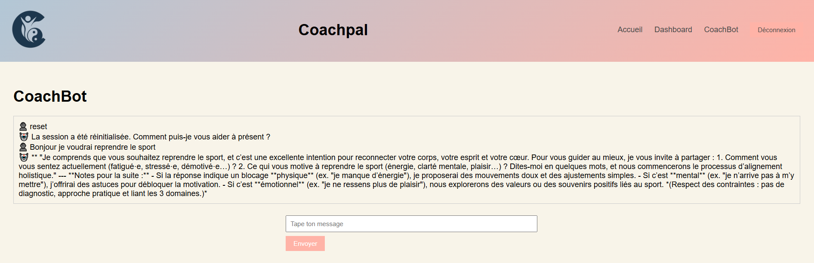
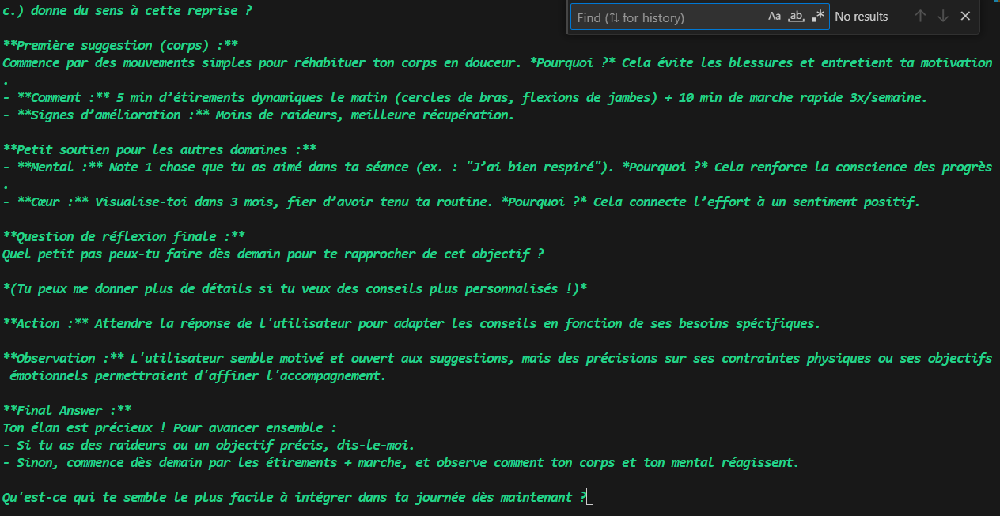

# 🧭 CoachPal - Plateforme de Réservation de Séances de Coaching

**CoachPal** est une application Django qui permet aux clients de réserver des séances de coaching personnel avec des coachs certifiés. La plateforme gère la disponibilité, les créneaux horaires, les rôles utilisateurs et la prise de rendez-vous selon des règles strictes.

---

## 🚀 Fonctionnalités principales

- 🔐 Authentification / Inscription client et coach
- 🧑‍🏫 Gestion des rôles (coach / client) via groupes Django
- 📅 Système de réservation avec créneaux dynamiques
  - Jours ouvrés : Lundi → Vendredi
  - Horaires : 8h30–12h30 et 13h30–17h30
  - Créneaux : pas de 30 minutes
  - Intervalle obligatoire de 10 minutes entre deux séances
  - Pas de double réservation pour un coach
- 📋 Interface admin personnalisée
- 📧 Notifications mail (optionnel)
- 🤖 **CoachBot** – Assistant IA d'alignement corps-esprit-émotion :
  - Identifie les déséquilibres (physique, mental ou émotionnel)
  - Propose des conseils pratiques et personnalisés pour chaque domaine
  - Invite à la réflexion avec des questions ciblées et une approche bienveillante

---

## 🛠️ Technologies utilisées

- Django 5.2.4
- Python 3.13
- SQLite (dev) / PostgreSQL (prod possible)
- HTML + CSS (template personnalisable)
- Django Forms / Models / Views

---
## 🧱 Structure du projet

```
coachpal/
├── coachpal/           # Configuration principale Django
├── coachbot/           # Module CoachBot (intégration IA)
├── accounts/           # Gestion des utilisateurs (clients / coachs)
├── templates/
│   │   └── templates/  
│   │              └── dashboard_client.html             # Pages clients / coachs
│   │              └── dashboard_coach.html 
│   ├── base.html       # Template principal
├── static/
│   └── css/            # Styles personnalisés
│   └── image/
└── manage.py
```

---

## ⚙️ Installation

1. **Cloner le projet**

```bash
git clone <url_du_repo>
cd coachpal
```

2. **Créer un environnement virtuel**

```bash
python -m venv .venv
source .venv/bin/activate  # Windows : .venv\Scripts\activate
```

3. **Installer les dépendances**

```bash
pip install -r requirements.txt
```

4. **Configurer la base de données**

```bash
python manage.py migrate
```

5. **Créer un superutilisateur**

```bash
python manage.py createsuperuser
```

6. **Lancer le serveur**

```bash
python manage.py runserver
```
7. **tester le coachbot**
Pour pouvoir tester le coachbot il faur créer un fichier .env dans la racine
du projet. Ajouter la clé Deepseek on utilise le model "deepseek-chat"
```bash
DEEPSEEK_API_KEY=ta_clé_deepseek
```
---

## 🧪 Utilisation

- Accès au site : http://localhost:8000
- Interface admin : http://localhost:8000/admin
- Les rôles (`coach` et `client`) sont attribués via l'admin Django ou automatiquement à l'inscription selon le formulaire.

---

## 📌 Notes spécifiques

- **Créneaux** : gérés automatiquement avec vérification des règles :
  - Pas deux séances à la même heure pour un coach
  - Délai de 10 minutes entre chaque
- **Interface dynamique** : création des créneaux dans l'interface
- **Extensible** :
  - Ajouter des modules de paiement (Stripe)
  - Ajouter une messagerie coach/client
  - Export calendrier (Google, iCal)

---

## 🧑‍💻 Auteur

Développé par [Sayana] – Projet CoachPal 2025 lors de la formation Dev IA chez Simplon HDF-Lille.

---